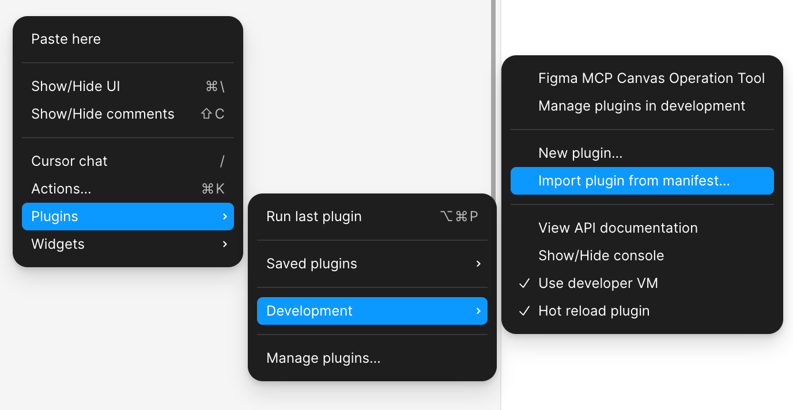

# Figma MCP Server

基于 Model Context Protocol (MCP)的 Figma API 服务器实现，支持 Figma 插件和小部件(Widget)集成。

## 功能特点

- 通过 MCP 与 Figma API 交互
- WebSocket 服务器用于 Figma 插件通信
- 支持 Figma 小部件开发
- 支持命令行参数设置环境变量
- 提供丰富的 Figma 操作工具

## 安装

1. 克隆仓库:

```bash
git clone <repository-url>
cd figma-mcp
```

2. 安装依赖:

```bash
bun install
```

## 配置

### 环境变量

创建一个`.env`文件并设置以下环境变量:

```
FIGMA_PERSONAL_ACCESS_TOKEN=your_figma_token
PORT=3001
NODE_ENV=development
```

### 获取 Figma 访问令牌

1. 登录[Figma](https://www.figma.com/)
2. 访问账户设置 > 个人访问令牌
3. 创建新的访问令牌
4. 将令牌复制到`.env`文件或通过命令行参数传递

## 使用方法

### 构建项目

```bash
bun run build
```

### 运行开发服务器

```bash
bun run dev
```

### 使用命令行参数

支持通过`-e`参数设置环境变量:

```bash
bun --watch src/index.ts -e FIGMA_PERSONAL_ACCESS_TOKEN=your_token -e PORT=6000
```

也可以使用专用的 token 参数:

```bash
bun --watch src/index.ts --token your_token
```

或简写:

```bash
bun --watch src/index.ts -t your_token
```

## 在 Cursor 中配置 MCP

在`.cursor/mcp.json`文件中添加:

```json
{
  "Figma MCP": {
    "command": "bun",
    "args": [
      "--watch",
      "/path/to/figma-mcp/src/index.ts",
      "-e",
      "FIGMA_PERSONAL_ACCESS_TOKEN=your_token_here",
      "-e",
      "PORT=6000"
    ]
  }
}
```

## 可用工具

服务器提供以下 Figma 操作工具:

- 文件操作: 获取文件、版本等
- 节点操作: 获取和操作 Figma 节点
- 注释操作: 管理 Figma 文件中的注释
- 图像操作: 导出 Figma 元素为图像
- 搜索功能: 在 Figma 文件中搜索内容
- 组件操作: 管理 Figma 组件
- 画布操作: 创建矩形、圆形、文本等
- 小部件操作: 管理 Figma 小部件

## Figma 插件开发

### 插件简介

Figma 插件是扩展 Figma 功能的定制化工具，可以自动化工作流程、添加新功能或与外部服务集成。本 MCP 服务器提供了便捷的方式来开发、测试和部署 Figma 插件。

### 构建与测试

构建插件:

```bash
bun run build:plugin
```

在开发模式下运行:

```bash
bun run dev:plugin
```

### 在 Figma 中加载插件



1. 在 Figma 中右键打开菜单 -> Plugins -> Development -> Import plugin from manifest...
2. 选择插件 `manifest.json` 文件
3. 现在你的插件将出现在 Figma 的插件菜单中

### 插件与 MCP 服务器交互

插件可以通过 WebSocket 与 MCP 服务器通信，实现:

- 复杂的数据处理
- 外部 API 集成
- 跨会话数据持久化
- AI 功能集成

## 开发

### 构建小部件

```bash
bun run build:widget
```

### 构建插件

```bash
bun run build:plugin
```

### 开发模式

```bash
bun run dev:widget  # 小部件开发模式
bun run dev:plugin  # 插件开发模式
```

## 许可证

MIT
